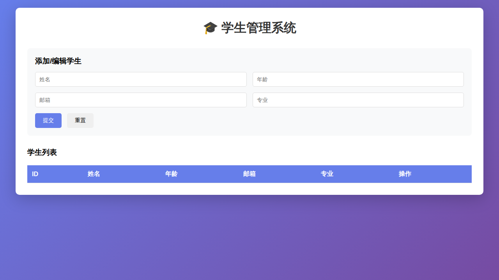

# 学生管理系统

一个基于 FastAPI 和简单 HTML 的学生管理系统。

## 项目截图



## 项目结构

```
student-test-project/
├── backend/
│   ├── main.py          # FastAPI 后端代码
│   └── requirements.txt # Python 依赖
└── frontend/
    └── index.html       # 前端 HTML 页面
```

## 快速开始

### 后端

1. 安装依赖：
```bash
cd backend
pip install -r requirements.txt
```

2. 启动服务器：
```bash
python main.py
```

后端服务将在 http://localhost:8000 启动

### 前端

直接在浏览器中打开 `frontend/index.html` 文件即可。

## API 接口

- `GET /api/students` - 获取所有学生
- `GET /api/students/{id}` - 获取单个学生
- `POST /api/students` - 创建新学生
- `PUT /api/students/{id}` - 更新学生信息
- `DELETE /api/students/{id}` - 删除学生

## 功能特性

- ✅ 添加学生
- ✅ 编辑学生信息
- ✅ 删除学生
- ✅ 查看学生列表
- ✅ 响应式设计
