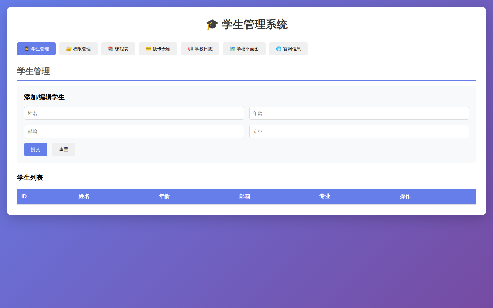
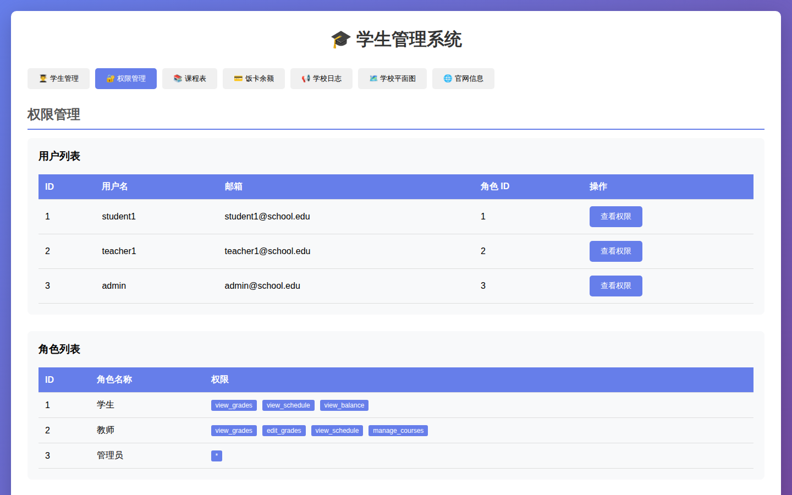
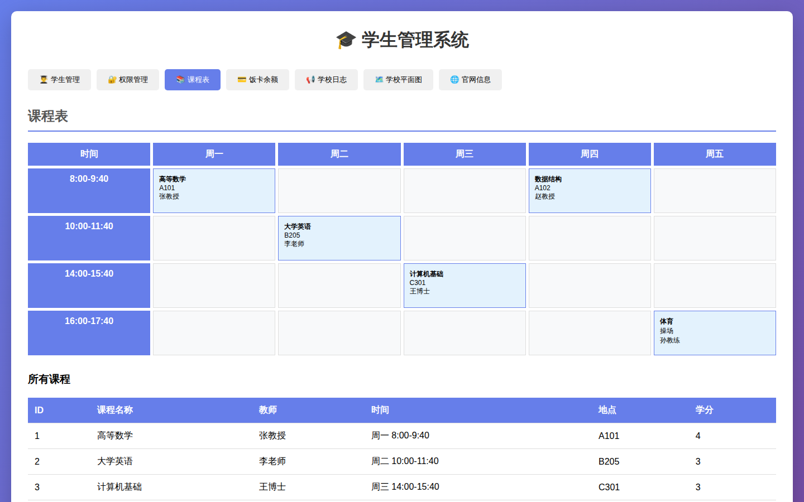
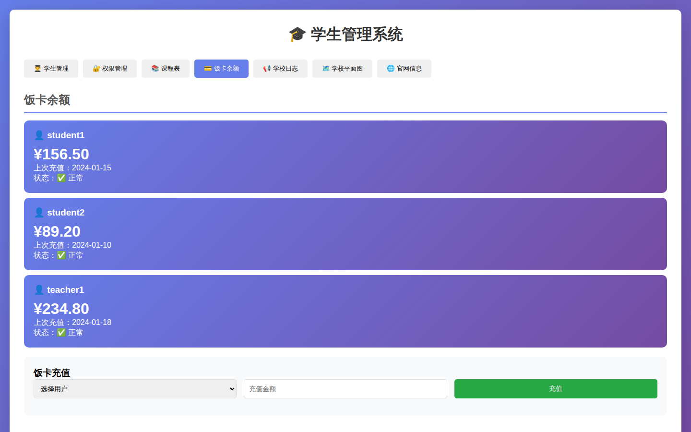
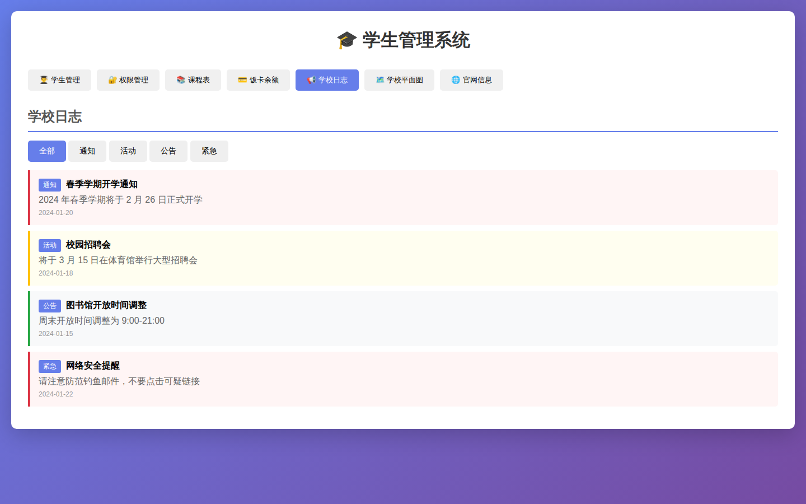
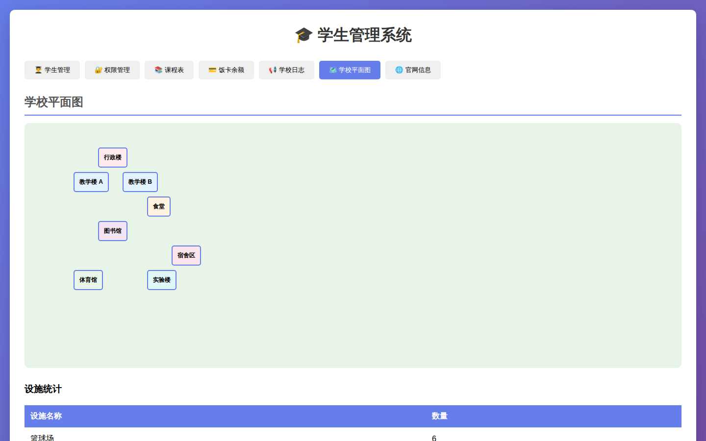
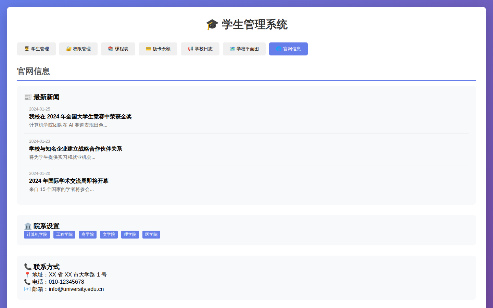

# 学生管理系统

一个功能完整的学生管理系统，基于 FastAPI 后端和 HTML 前端，包含多个实用模块。

## ✨ 功能特性

- 👨‍🎓 **学生管理** - 学生信息的增删改查
- 🔐 **权限管理** - 用户角色和权限配置
- 📚 **课程表** - 可视化课程安排
- 💳 **饭卡余额** - 余额查询和在线充值
- 📢 **学校日志** - 通知、公告、活动发布
- 🗺️ **学校平面图** - 校园建筑分布展示
- 🌐 **官网信息** - 新闻、院系、联系方式

## 📸 功能截图

### 👨‍🎓 学生管理


### 🔐 权限管理


### 📚 课程表


### 💳 饭卡余额


### 📢 学校日志


### 🗺️ 学校平面图


### 🌐 官网信息


## 🏗️ 项目结构

```
student-test-project/
├── .github/
│   └── workflows/
│       └── screenshot.yml    # GitHub Actions 自动截图
├── backend/
│   ├── main.py               # FastAPI 后端
│   └── requirements.txt      # Python 依赖
├── frontend/
│   └── index.html            # 前端页面
├── scripts/
│   ├── screenshot.js         # Playwright 截图脚本
│   └── generate-readme.js    # README 生成脚本
├── assets/                   # 截图资源
└── README.md                 # 项目文档
```

## 🚀 快速开始

### 后端

1. 安装依赖：
```bash
cd backend
pip install -r requirements.txt
```

2. 启动服务器：
```bash
python main.py
```

后端服务将在 http://localhost:8000 启动

### 前端

直接在浏览器中打开 `frontend/index.html` 文件即可。

## 📡 API 接口

### 学生管理
- `GET /api/students` - 获取所有学生
- `GET /api/students/{id}` - 获取单个学生
- `POST /api/students` - 创建新学生
- `PUT /api/students/{id}` - 更新学生信息
- `DELETE /api/students/{id}` - 删除学生

### 权限管理
- `GET /api/roles` - 获取所有角色
- `GET /api/users` - 获取所有用户
- `GET /api/users/{id}/permissions` - 获取用户权限

### 课程表
- `GET /api/courses` - 获取所有课程
- `GET /api/courses/{id}` - 获取单个课程

### 饭卡余额
- `GET /api/card-balance` - 获取所有饭卡余额
- `GET /api/card-balance/{username}` - 获取指定用户余额
- `POST /api/card-balance/{username}/recharge?amount={amount}` - 饭卡充值

### 学校日志
- `GET /api/school-logs` - 获取学校日志
- `GET /api/school-logs/{id}` - 获取单个日志

### 学校平面图
- `GET /api/campus-map` - 获取学校平面图
- `GET /api/campus-map/buildings` - 获取建筑物列表
- `GET /api/campus-map/facilities` - 获取设施列表

### 官网信息
- `GET /api/website` - 获取官网所有信息
- `GET /api/website/news` - 获取新闻列表
- `GET /api/website/departments` - 获取院系列表
- `GET /api/website/contact` - 获取联系方式

## 🔄 GitHub Actions

项目配置了自动截图工作流：
- 每次 push 到 main 分支时自动运行
- 使用 Playwright 捕获所有功能模块的截图
- 自动更新 README.md 中的截图

## 📝 Mock 数据

所有功能模块都使用 Mock 数据，无需数据库即可体验完整功能。

## 📄 License

MIT License
